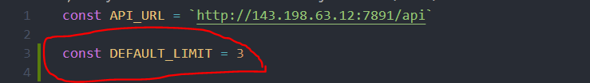

# ReadMe

This will explain the changes that are made to make some of the contents the content dynamic

## Newly added Files

#### Inside assets folders

##### css/

```
detail/index.css
home/home.css
```

##### js/

```
dynamic-data/home - news.js;
dynamic-data/beer.js;
dynamic-data/brand_fetail.js;
dynamic-data/news_detail.js;
dynamic-data/stories.js;
dynamic-data/stories_detail.js;
```

## Configuration

Inside the folder `assets/js/dynamic-data/..` open all files and change the value for the constant variable `API_URL`; replace the value withe the actual API.

```
const API_URL = "http://143.198.63.12:7891/api"
```

> Note: _I couldn't find a away to make the API_URL variable global_ for now use the above way to replace it.

### Updating Limit

To update limit value go to the file `assets/js/dynamic-data/home-news.js` then on line number 3 you can change the `DEFAULT_LIMIT` number. I would suggest it to be 6



## API routes

### Stories

- **stories list**: _/admin/stories_
- **stories detail**: _/admin/story?id=".."_

### Home

- **slider**: _/admin/news_feed_
- **news section**: _/admin/news_feed_
- **news detail**: _/admin/news_feed?id=".."_

### beer

- **slider**: _/admin/brands_
- **slider-detail**: _/admin/brand?id=".."_


### API references 

[Fetch API](https://developer.mozilla.org/en-US/docs/Web/API/Fetch_API) - The Fetch API provides an interface for fetching resources
